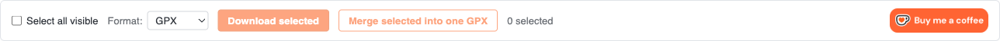
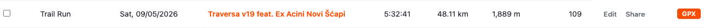
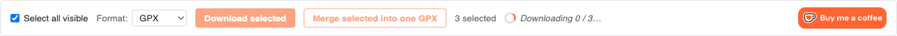

# Strava Bulk GPX Export

[](https://github.com/mladimatija/strava-bulk-gpx/actions/workflows/ci.yml)
[](LICENSE)
[](package.json)
[](https://ko-fi.com/D1D51ZGOQK)

A small Chrome extension that adds **bulk export** to Strava's _My Activities_ page. Filter or search the list however you like in Strava's own UI, then download many activities at once - as individual files or zipped together. Choose between **GPX** (route), **TCX** (route + HR/cadence/power), or **Original** (the exact file you uploaded - `.fit`, `.gpx`, `.tcx`, …).

> **Not affiliated with Strava, Inc.** "Strava" is a trademark of Strava, Inc.

## Screenshots

<!--
These three PNGs are generated automatically by `npm run test:screenshots`
(Playwright drives the fixture page in tests/fixtures/, takes one screenshot
per state, writes them here). If you see broken-image icons, you haven't run
that command yet.
-->

| Toolbar                                  | Per-row buttons                                  | Bulk download                               |
| ---------------------------------------- | ------------------------------------------------ | ------------------------------------------- |
|  |  |  |

---

## What it does

When you open <https://www.strava.com/athlete/training>, the extension:

- Adds a small toolbar above the activity table with a **Select all visible** checkbox, a **Format** dropdown (GPX / TCX / Original), a **Download selected** button, and a **Merge selected into one GPX** button.
- Adds a checkbox at the start of every row and a per-row export button at the end. The button's label tracks the format dropdown - it reads **GPX**, **TCX**, or **Original** depending on what's selected.
- Click the row button → one file lands in your Downloads in the chosen format.
- Click **Download selected** with one row checked → one file (no zip).
- Click **Download selected** with multiple rows checked → a `.zip` containing one file per activity (named `strava_<id>.gpx`, `strava_<id>.tcx`, or - for **Original** - whatever extension the file was uploaded with). The zip itself is named `strava_<format>_<date>.zip` so different batches don't collide in your Downloads folder.
- Click **Merge selected into one GPX** → a single `strava_merged_<date>.gpx` containing one `<trk>` per activity. Useful when you want a multi-day trip rendered as one track collection in RideWithGPS / Gaia / Komoot, or archived as a single file. The merge button stays visible in all modes but disables outside GPX with a tooltip explaining why (TCX and Original aren't trivially concatenable).

The three formats map to what Strava's own _Export_ menu offers on individual activity pages:

- **GPX** - the route as standard GPX 1.1. Best for mapping tools (RideWithGPS, Gaia, Komoot).
- **TCX** - route plus heart rate, cadence, and power streams. Best for Garmin Connect, TrainingPeaks, or any tool that wants the sensor data.
- **Original** - the exact byte-for-byte file you originally uploaded (`.fit` for most modern head units, `.gpx` from phone apps, etc.). Best for archival or for tools that prefer the manufacturer's native format.

Indoor / no-GPS activities don't get a checkbox or a button - there's nothing to export. Everything else - search, sport filter, date filter, sort, pagination - is Strava's own UI. The extension just hooks into whatever's currently on screen.

## Why it exists

Strava has _Export GPX_ on the individual activity page, and a one-time full-account export buried in account settings. Neither of those is useful when you want:

- All your activities from a specific trip you tagged in the title.
- A keyword-filtered subset (e.g., every `commute` activity).
- A single zip you can hand to RideWithGPS, Gaia, Komoot, your coach, or just archive on disk.
- A single merged `.gpx` that shows every day of a multi-day trip as one continuous track collection.

The extension fills exactly that gap and nothing else.

## Why a browser extension instead of a hosted service

Two short answers, the rest in [PRIVACY.md](PRIVACY.md):

1. **Trust model.** A hosted service that touched your Strava data would need either your OAuth tokens (Strava's official OAuth API doesn't expose keyword search on the activity list, so you'd lose the search feature) or your session cookie (a privacy issue – the cookie grants full account access, much more than OAuth's scoped permissions). A local extension sidesteps both: nothing leaves your browser.

2. **Rate limits.** Strava's per-app rate limits (100 requests / 15 min, 1,000 / day) are shared across every user of an app. A hosted service for thousands of people would hit them in minutes. An extension makes requests from each user's own browser session – there is no shared bucket.

The extension uses Strava's own native export endpoints:

- `https://www.strava.com/activities/<id>/export_gpx`
- `https://www.strava.com/activities/<id>/export_tcx`
- `https://www.strava.com/activities/<id>/export_original`

These are the same URLs the _Export GPX / TCX / Original_ links use on individual activity pages. The downloaded files are byte-for-byte identical to what you'd get by clicking those links manually. Bulk mode is just N concurrent calls to the chosen endpoint, with the responses streamed into a zip in your browser. For the **Original** format the per-file extension comes from the `Content-Disposition` header Strava returns, so a `.fit` from a Garmin and a `.gpx` from a phone end up correctly named in the same zip.

## Install

### From the Chrome Web Store

https://chromewebstore.google.com/detail/strava-bulk-gpx-export/nabkcpkedegngoebodobopcojpahgbba

### From source (developer mode)

```bash
git clone https://github.com/mladimatija/strava-bulk-gpx.git
cd strava-bulk-gpx
npm install         # also installs git hooks via simple-git-hooks
npm run build       # runs prebuild (icons + kofi + type-check) then vite build
```

Then in Chrome:

1. Open `chrome://extensions`.
2. Toggle **Developer mode** on (top right).
3. Click **Load unpacked**.
4. Select the `dist/` folder.

After a `git pull`, run `npm run build` again and click the reload icon next to the extension in `chrome://extensions`.

## Use

1. Log in to <https://www.strava.com> if you aren't already.
2. Visit <https://www.strava.com/athlete/training>.
3. Use Strava's own search and filters to get the list you want.
4. Pick a format from the toolbar dropdown (defaults to **GPX**).
5. Click the per-row button on a single row, or check multiple rows and click **Download selected** in the toolbar.
6. In GPX mode you can also click **Merge selected into one GPX** to get a single combined `.gpx` instead of a zip.

The download respects Strava's pagination – only currently visible rows can be checked. To download more than one page worth, page through and download each page's batch.

## Development

```bash
npm run dev         # vite dev server with HMR
npm run check       # lint + format:check + type-check (CI gate)
npm run lint        # eslint .  /  npm run lint:fix to autofix
npm run format      # prettier --write .  /  format:check for verification only
npm run type-check  # tsc --noEmit; runs automatically as part of prebuild
npm run build       # type-check + production build to dist/
npm run icons       # regenerate icon PNGs from icons/icon.svg
npm run kofi        # refetch Ko-fi button asset into src/kofi-asset.ts
npm run package     # builds and zips dist/ into strava-bulk-gpx.zip for store upload
```

The project layout:

```
.
├── manifest.json           # MV3 manifest, declares one content-script match
├── tsconfig.json           # strict TS config, bundler-style resolution
├── vite.config.ts          # @crxjs/vite-plugin + inline manifest version sync
├── eslint.config.mjs       # flat config, type-aware TS rules scoped to src/
├── prettier.config.cjs     # 2-space tabs, single quotes, 120 print width
├── icons/icon.svg          # source for the icon; PNGs generated via npm run icons
├── scripts/
│   ├── clean.js            # wipes dist/ before each build
│   ├── build-icons.js      # sharp-based SVG → PNG renderer
│   └── build-kofi.js       # fetches kofi6.png and emits src/kofi-asset.ts
└── src/
    ├── content.ts          # mounts the toolbar, observes Strava's React table
    ├── downloader.ts       # single + bulk download orchestration
    ├── types.ts            # shared interfaces (ActivityRow, ProgressEvent, …)
    ├── kofi-asset.ts       # generated base64 data URL for the Ko-fi button
    └── styles.css          # toolbar + row styling, sbgx-* namespaced
```

The repo's version of truth is `package.json.version`. `vite.config.ts` reads it at build time, strips any SemVer prerelease tail (Chrome's manifest format doesn't allow `-beta.1` etc.), and writes the result into `manifest.json.version`. Don't edit `manifest.json.version` by hand. `npm version patch` is the right way to cut a new release.

### Localization

User-facing strings live in `_locales/<code>/messages.json`. English (`en`) is the source of truth; the manifest's `default_locale` is `en` so any string missing from another locale falls back to it. The Chrome i18n system picks the right locale automatically based on the user's browser language - no flag, no extension setting.

Code calls strings through a typed `t()` helper in `src/i18n.ts`:

```ts
import { t } from './i18n.ts';
btn.textContent = t('downloadSelected');
setStatus(t('downloadingProgress', [String(completed), String(total)]), 'info', { spinner: true });
```

The `MessageKey` union in `src/i18n.ts` is the compile-time check: a typo in a key is a TypeScript error, not a silent runtime empty-string.

See [`_locales/README.md`](_locales/README.md) for the list of shipped locales and how to add a new one.

Pre-commit hooks are installed via `simple-git-hooks` + `lint-staged` - they run on `npm install` automatically and lint/format only staged files on each commit.

### Testing

```bash
npm run test:install     # one-time: install Playwright's bundled Chromium
npm run build            # tests run against dist/, so build first
npm test                 # Playwright E2E suite (tests/e2e/*.spec.ts)
npm run test:screenshots # regenerates docs/screenshots/*.png from the same fixture
```

The E2E tests load the built extension into a real Chromium instance and intercept the `https://www.strava.com/athlete/training` URL to serve `tests/fixtures/strava-training.html` instead - so Chrome thinks the content script is running on Strava, but the page is our own fake table. No real Strava account needed.

`npm run test:screenshots` uses the same fixture to capture the three README images into `docs/screenshots/`. The bulk-mode screenshot slows the mocked `/export_gpx` responses so the spinner state stays visible mid-flight.

A note on running the tests: the fixture launches Chromium with `headless: false` (a visible window pops up) because Chrome only loads extensions in headful mode - the old headless mode silently ignores `--load-extension`, and Chrome 137+ additionally requires `--disable-features=DisableLoadExtensionCommandLineSwitch` to permit the flag at all. CI wraps the command in `xvfb-run` so Linux runners have a virtual display. On macOS and Windows the visible browser is fine; if you're on a headless Linux dev machine, prefix `npm test` with `xvfb-run --auto-servernum`.

By default the tests use Playwright's bundled Chromium - pinned to whatever Playwright version is installed, reproducible across machines. To run against your installed Chrome stable instead (closer to what end users have but less reproducible), set `PWTEST_BROWSER=chrome`:

```bash
PWTEST_BROWSER=chrome npm test
```

Same flag set, different binary.

## Privacy

See [PRIVACY.md](PRIVACY.md). The short version: the extension has no backend, no analytics, no telemetry. All requests go to `strava.com` and only when you click a download button.

## Like this?

If it saves you time:

[](https://ko-fi.com/D1D51ZGOQK)

Free either way.

## License

[MIT](LICENSE).

## Disclaimer

This extension is not affiliated with, endorsed by, or sponsored by Strava, Inc. It uses the same internal endpoints that Strava's own _My Activities_ page uses, on your behalf, while you are logged in to your own account. Use it for personal data export only. Strava's [Terms of Service](https://www.strava.com/legal/terms) apply to your account and your interactions with their service.
